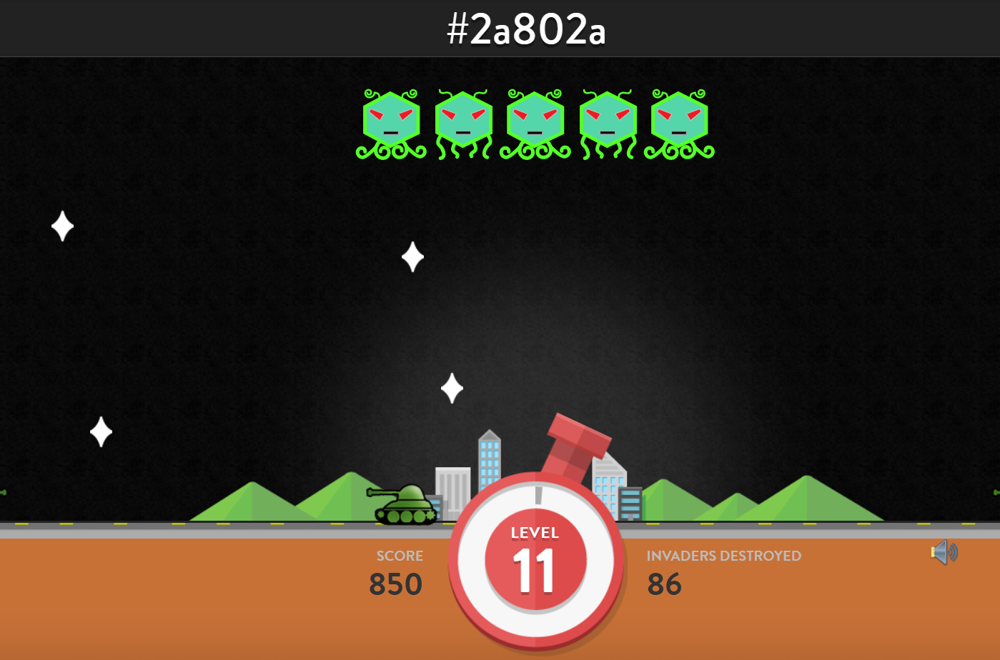

# HEXINVADER



for education purpose using selenium

auto clicking color

this program make for window user (driver limitation) if linux find another driver instead and change version of driver in python code file

select the path to the chrorm driver of your os

```python
...
driver = webdriver.Chrome(os.path.join('chromedriver', 'chromedriver'+str(sys.argv[1]))+'.exe')
....
```

# Getting Started

```python
$ python3 -m venv venv
$ source venv/bin/activate
(venv) $ pip install -r requirements.txt
```

or with anaconda

```python
conda create --name bot python=3.7
conda activate bot
pip install -r requirements.txt
```

# Usage

check version of chrome

```python
wmic datafile where name="C:\\Program Files\\Google\\Chrome\\Application\\chrome.exe" get Version /value
>>>
Version=88.0.4324.182
```

After get version

```python
python ./hexinvader.py 88
```

the browser will open and enjoin with manual click on button

while the playing the game, it automatically click on matched color element